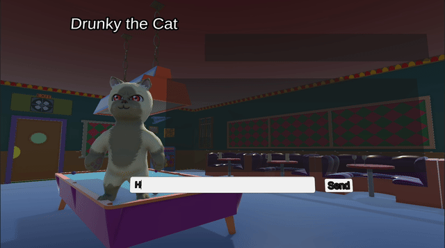
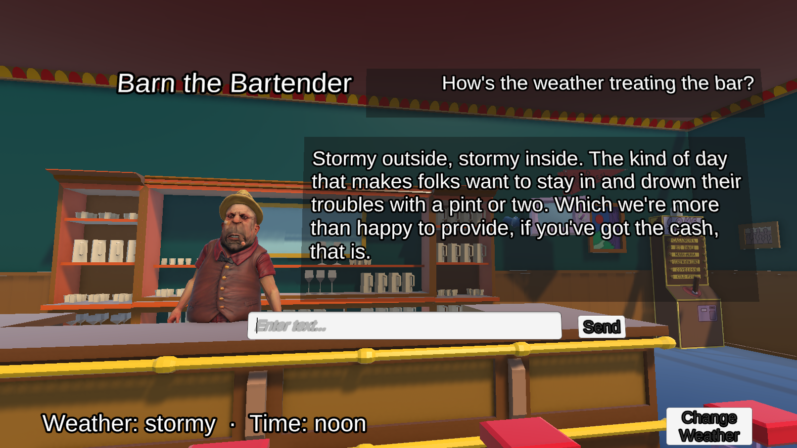
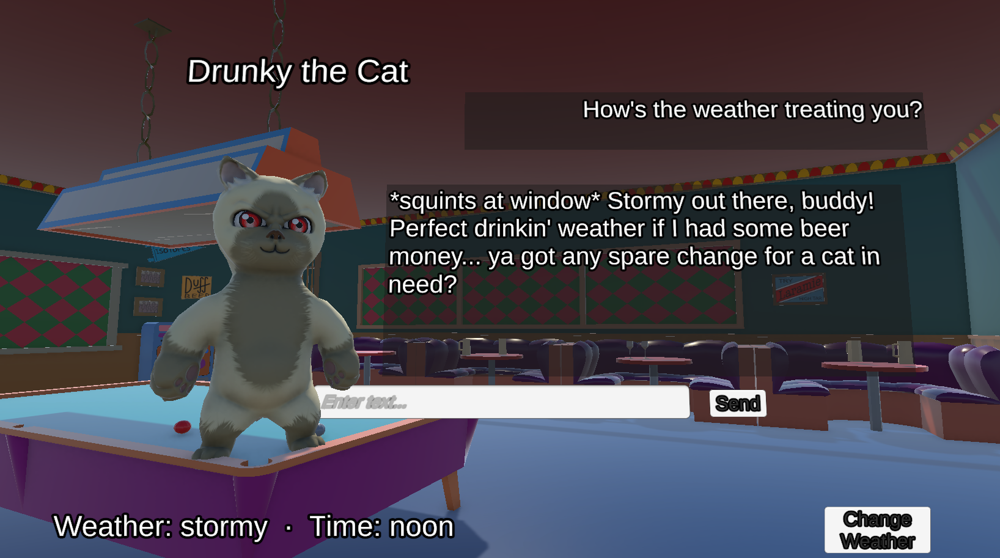

# LLM Characters
Unity package built to explore LLM integration in games: real-time streaming and dynamic context injection for believable NPCs.

Supports Unity 6. Zero external dependencies.



## What it is for
LLM Characters is a Unity package that connects NPC dialogue to language models. The core idea is that each NPC has a layered context system: a stack of ScriptableObjects that define what the character knows. 

Contexts can be shared between NPCs (a tavern's description, the current weather, a recent in-game event) or private to one character (their backstory, secrets, current mood). These are assembled into a system prompt automatically before every LLM request, so the NPC's responses are always grounded in the current game state.

The package ships with two providers (for connecting to the LLM): **Anthropic's Claude** (cloud, high quality, requires API key) and **Ollama** (local, free, no internet needed). Swapping between them is a single Inspector field, no code changes. The same interface makes it straightforward to connect any other LLM or custom backend.

## How it works

The pipeline is event-driven. `NPCBrain` assembles the system prompt from the NPC's personality and context layers, then hands the request to `StreamHandler`. `StreamHandler` calls the active `ILLMProvider` and fires events as the response streams in token by token. In the Demo, any component can subscribe to `DialogueUI`, which drives a typewriter effect, but the rest of the SDK doesn't depend on it.

```
NPCBrain → StreamHandler → ILLMProvider (Anthropic / Ollama / Mock)
               ↓
   OnRequestStarted / OnTokenReceived / OnResponseComplete / OnError
               ↓
           DialogueUI (or your own subscriber)
```

`NPCBrain` is UI-agnostic. Plug in your own UI by subscribing to the same four events without touching SDK code.

## NPC Context System


What an NPC knows is assembled from a stack of context layers, each with a `Specificity` value that determines precedence on key collisions:

| Layer | Specificity | Example |
|---|---|---|
| World | 0 | weather, time of day, global events |
| Location | 10 | tavern crowd, classroom students |
| Individual | 100 | NPC backstory, secrets |

Context is stored in ScriptableObjects. Two NPCs pointing at the same asset share it live, so a runtime `Set()` call is seen by all of them on their next turn, with no events or subscriptions needed.

### Dynamic injection example

```csharp
worldContext.Set("weather", "stormy");
worldContext.Set("recent_event", "A fight broke out near the docks.");
npcContext.Set("player_reputation", "trusted");
```

These entries get merged into the system prompt automatically before every request.

In these screenshots, the NPCs are reacting to a randomized Weather condition, in this case: Stormy at Noon.




## Providers

The `ILLMProvider` interface decouples the SDK from any specific LLM backend. Each provider is a MonoBehaviour that implements `SendAsync`, handling its own wire format, streaming protocol, and connection config. Swapping providers is an Inspector field on `StreamHandler`. Adding a new one means writing one class that implements the interface, with no changes to the SDK core.

| Provider | Model quality | Cost | Internet required |
|---|---|---|---|
| `AnthropicProvider` | High (Claude) | Pay per token | Yes |
| `OllamaProvider` | Medium (Llama, Mistral, Phi…) | Free | No |
| `MockProvider` | Templated text | Free | No |

**Anthropic (Claude)** produces significantly more coherent, context-aware responses, especially for longer conversations or nuanced character voices. Requires an API key and an internet connection.

**Ollama** runs open-source models entirely on the player's machine. No API key, no data leaves the device, works offline. Response quality depends on the model and available hardware. Requires Ollama installed locally with the target model already pulled.

**Mock** returns templated responses locally. Useful for testing UI, context wiring, and scene setup without burning API credits or requiring a running server.

## Features

- Real-time token streaming with typewriter reveal and Animal Crossing-style SFX
- Conversation history window (configurable turn count)
- Scene Knowledge field per NPC: static grounding facts that prevent hallucination
- Response Format controls per NPC: sentence cap, asterisk actions, emoji, custom rules
- JSONL session logging with token estimates and cost tracking
- Provider-agnostic generation config (`LLMConfig`): credentials live on each provider component, not in shared assets

## Limitations & production considerations

**API key exposure:** `AnthropicProvider` stores the API key as a serialized field on a GameObject. In a shipped build, Unity serialized data can be extracted with asset deserialization tools. This is acceptable for prototypes and game-jams, but not for shipped products. The recommended production architecture is a lightweight backend server that holds the key and proxies requests. The client calls your server, your server calls Anthropic. A custom `ILLMProvider` implementation pointing at your own endpoint takes around 30 lines of code. 

**Local LLM distribution:** `OllamaProvider` requires Ollama installed and a model pulled on the player's machine before the game runs. The SDK does not bundle, download, or manage models. Shipping a game with a local LLM requires a separate distribution and installation strategy (a launcher, a bundled runtime, or an in-game download flow) that is outside the scope of this package.

## Installation

Add via Unity Package Manager using the Git URL:

```
https://github.com/florigod/llm-characters.git
```

Or clone and add as a local package.

## Documentation

Full API reference, context system details, and provider setup guides are in [`Documentation~/`](Documentation~/).


### Author: Florian Mathe